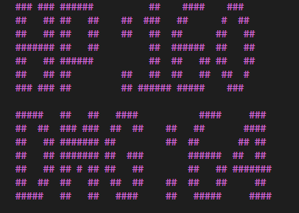
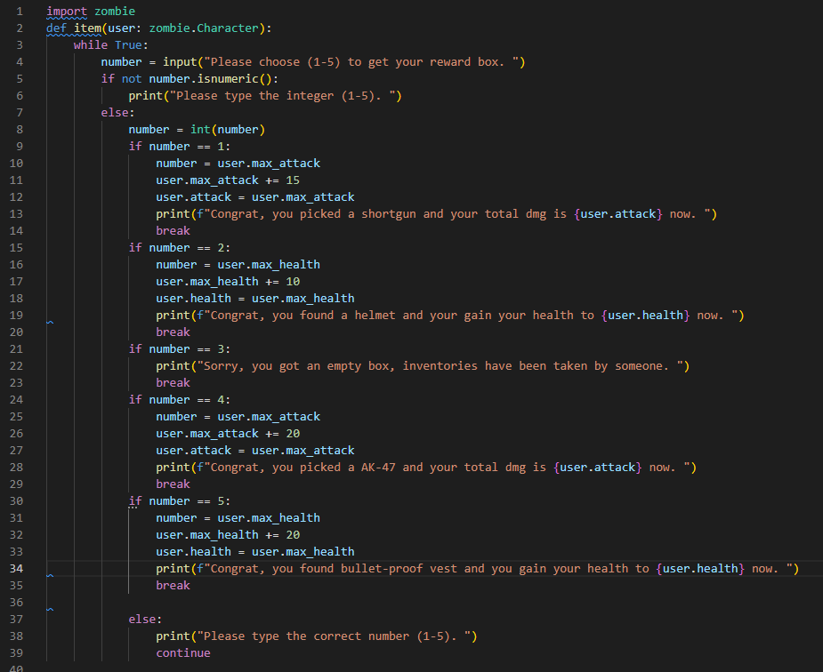
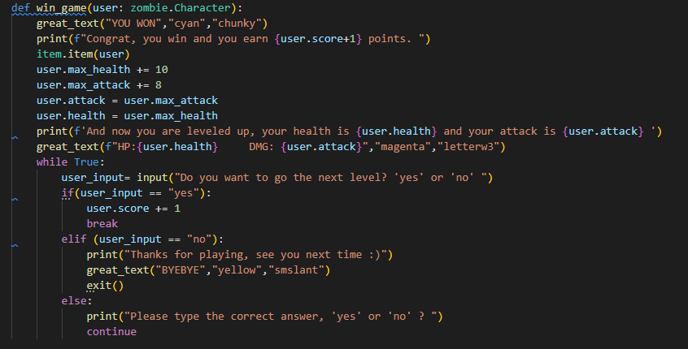
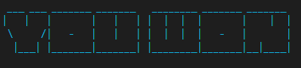
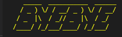

# T1A3 Terminal Application - WING MAN SIU  13183

## Presentation Link >

<>

### R.3. References Source

---
My idea of this application come from a PC game called Left 4 Dead (L4D) which is a FPS Zombie game. So I used those special zombies' name from this game to be my application's bosses.

### R.4. Source Control Repository >

<https://github.com/fishball0741/T1A3>

### R.5. Identify any code style guide or styling

### R.6. Develop and Describe THREE Features

---

.1 In Choose.py, there are one feature called choose_character() which is for asking the user to choose a character and named the character. Since the user typed the correct gender which is male/ female and named the character then the system will output the character's traits such as (name, health, attack etc.) For the traits of the character which is from the class that I made in another file (zombie.py) so I did the import that file.
Moreover, I imported the 3rd party module which can output 3D and colorful text.
In case the user may type the wrong input to break the code, I did the loop to prevent that problem. The loop can make sure the correct input will transfer to the correct output. And the wrong input will ask the user to type again. And if the user did the correct input then the loop will break.
At the end, I did the return user to make sure the input can be used again for my whole application.

.2 In Item.py, there are one feature called item() which is only for the character to get the extra equipment to gain more health or attack to win the game when the character won each round. There are number 1-5 to equal to different items such as Shortgun, Helmet, AK-47 etc. And one of the number is an empty bos which means the character cannot get any reward. Each items can gain different health or attack. That's why I needed to import the Zombie.py to get the class of the character to gain their traits. So after each winning round, the system will ask the user to input the number 1 to 5 to choose different items. I set the loop to prevent any invalid input such as string input (not number.isnumeric) or the integer out of range, if happens then the system will ask the user to input again. If the user did the correct input then the loop will break.

.3 In battle.py, there are one feature called win_game which is the next feature when the character won the game. There are many functions, first is using the 3rd party module (great_text) to do the output and show the user that they won the battle. Then the system will transfer the code to item.py to execute the code in Item.py for the user to choose the reward. And then I did some codes to increase the traits for the character and show the output to the user and said because they won the game and leveled up now so gain more health and attack. Same, I used the 3rd party module to show the new max health and attack in output. After all showing the output, the user need to input 'yes' or 'no' to decide keep playing the next level or not. I did the loop here again for preventing the invalid input rather than 'yes' or 'no'. At the end, if the user decided to stop playing game and typed 'no' then will show the colorful 'byebye'(3rd party module) and one sentence to thank you the user to play, then exit the program.

### R.7. Develop an implementation plan

### R.8. A set of instructions to install the application

### Test Check Result