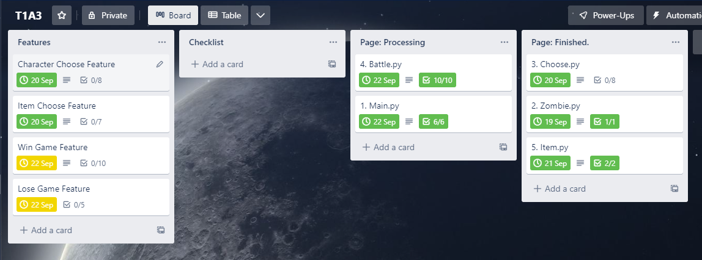
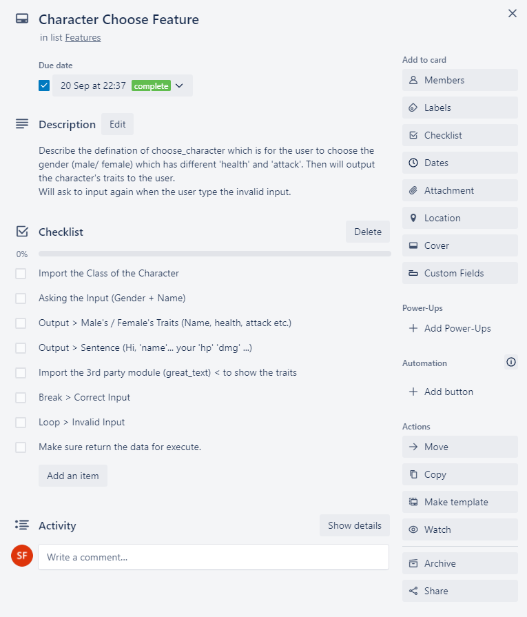
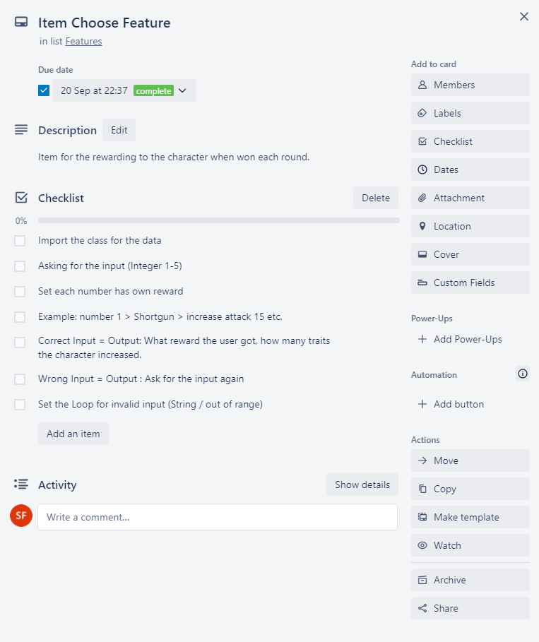
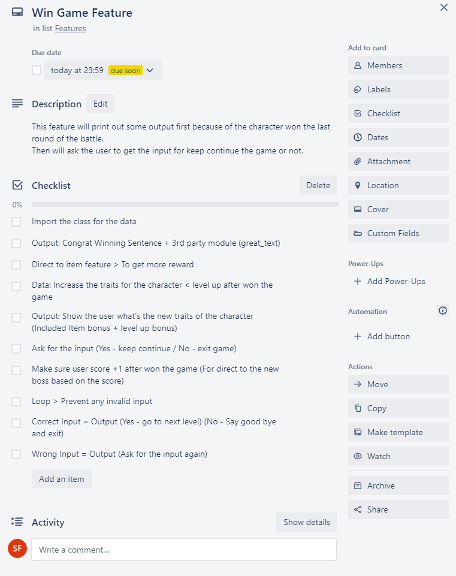
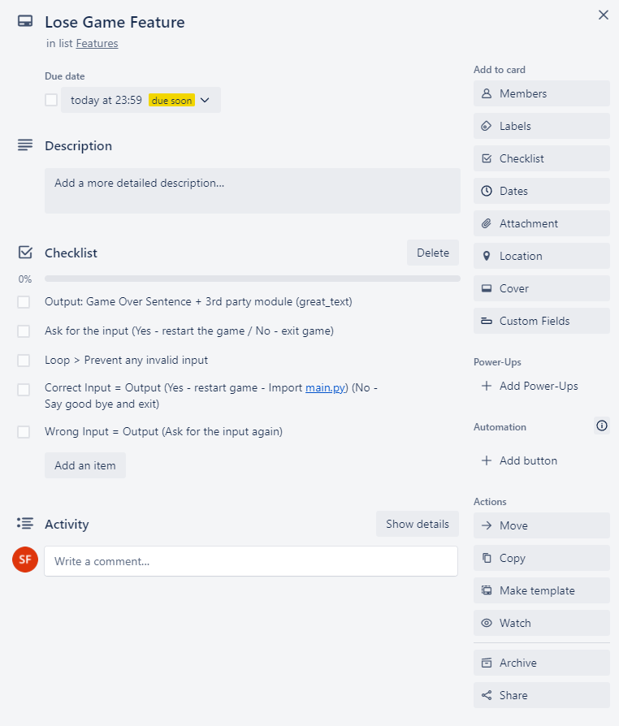

# T1A3 Terminal Application - WING MAN SIU  13183

## Presentation Link >

<>

### R.3. References Source

---
My idea of this application come from a PC game called Left 4 Dead (L4D) which is a FPS Zombie game. So I used those special zombies' name from this game to be my application's bosses such as 'Boomer', 'Hunter', 'Witch' etc.
Moreover, I used the third party module which called great_text which can print the colorful and 3D text on some key features of the game.

### R.4. Source Control Repository >

<https://github.com/fishball0741/T1A3>

### R.5. Identify any code style guide or styling


### R.6. Develop and Describe THREE Features

---


1). In Choose.py, there are one feature called choose_character() which is for asking the user to choose a character and named the character. Since the user typed the correct gender which is male/ female and named the character then the system will output the character's traits such as (name, health, attack etc.) For the traits of the character which is from the class that I made in another file (zombie.py) so I did the import that file.
Moreover, I imported the 3rd party module which can output 3D and colorful text.
In case the user may type the wrong input to break the code, I did the loop to prevent that problem. The loop can make sure the correct input will transfer to the correct output. And the wrong input will ask the user to type again. And if the user did the correct input then the loop will break.
At the end, I did the return user to make sure the input can be used again for my whole application.


2). In Item.py, there are one feature called item() which is only for the character to get the extra equipment to gain more health or attack to win the game when the character won each round. There are number 1-5 to equal to different items such as Shortgun, Helmet, AK-47 etc. And one of the number is an empty bos which means the character cannot get any reward. Each items can gain different health or attack. That's why I needed to import the Zombie.py to get the class of the character to gain their traits. So after each winning round, the system will ask the user to input the number 1 to 5 to choose different items. I set the loop to prevent any invalid input such as string input (not number.isnumeric) or the integer out of range, if happens then the system will ask the user to input again. If the user did the correct input then the loop will break.


3.) In battle.py, there are one feature called win_game which is the next feature when the character won the game. There are many functions, first is using the 3rd party module (great_text) to do the output and show the user that they won the battle. Then the system will transfer the code to item.py to execute the code in Item.py for the user to choose the reward. And then I did some codes to increase the traits for the character and show the output to the user and said because they won the game and leveled up now so gain more health and attack. Same, I used the 3rd party module to show the new max health and attack in output. After all showing the output, the user need to input 'yes' or 'no' to decide keep playing the next level or not. I did the loop here again for preventing the invalid input rather than 'yes' or 'no'. At the end, if the user decided to stop playing game and typed 'no' then will show the colorful 'byebye'(3rd party module) and one sentence to thank you the user to play, then exit the program.


### R.7. Develop an implementation plan

---


When I developed the implementation plan, I defined different sections to make it easier to understand and follow. Not only the features, I wrote the pages to decide how many pages should be created. I also set the deadline for all the cards because some of the files or features should be finished first.



The first feature is called Character Choose, which is for the user to choose a character from male or female. And based on what the user selected, different characters will have different traits (different of health and attack). So, this feature will ask the user to input the gender of the character and make a name for the character. Then the output will show all the traits and the name of the character.
After that, in case the user will accidentally enter some invalid input so I set the loop to prevent it. If there are any invalid input then the system will ask the user to input again.
At the end, those input will return to stored for execute the whold program.



The second feature is called Item Choose, which is for the user to choose the reward box for the character after each winning round. In this feature, the reward boxes will define to number 1 to 5, different number means different rewards which can increase the maximum health, attack or nothing :). So the user need to input the number 1 to 5 to choose the rewards. Then the output will show what kind of reward the user chose and how many traits the character gained.
As usual, I set the loop to prevent the invalid input (text or out of range).



The third feature is called Win Game, which is showing the reward and output after the character win each round. First, this feature will output the sentence and the colorful text to say congratulations of winning the battle. Then the system will direct to another feature which is Item to earn extra reward for the character. And then the system will continue to execute this feature. Moreover, this feature will increase the traits of the character and output to the user and say that for leveling up the character. This output will combine the traits of Item and Level-up reward, then output to the user.
At the end, there will be a loop for asking the user to input 'Yes' or 'No' to decide to continue the game or exit. If the user input 'Yes' then will continue the game and increase one score on user.score, because the level of the boss is based on how many score the character had.
Finally, as usual, I set the loop to prevent the invalid input (text or out of range).



The final feature is called Lose Game, which is for the character who has lose the game. So it will have the output to print the Game-Over sentence and some colorful text from the 3rd party module. After that, it will ask the user to input 'Yes' or 'No' to decide to restart the game or exit. If the user input 'Yes' then it will direct to the main.py for restarting the game from the beginning. If the user input 'No' then it will exit the game. At the end, I set the loop to prevent the invalid input and it will ask the user to input again if happened.

### R.8. A set of instructions to install the application


Make sure updated the PIP version  (pip install -- upgrade pip)
Python version >= 3.6.0
(sudo apt update)  (sudo apt install software-properties-common)

#### How to install and execute:

---


Press the Greed Color 'Code' Button or:
Copy this link below:
```(git@github.com:fishball0741/T1A3.git)```
And then go to your terminal


Type:  ```git clone git@github.com:fishball0741/T1A3.git```
After cloned the file, you can type


```cd T1A3```   #for direct to the folder (T1A3)
And  ```cd src```  #for direct to the folder (src)

At the end, you can execute this command below:


```./game.sh```


Also, there are two optional arguments which is ```./game.sh --gender=m``` and ```./game.sh --gender=f```, it is for the user to skip choosing the gender features.

And.. HAVE FUN :)