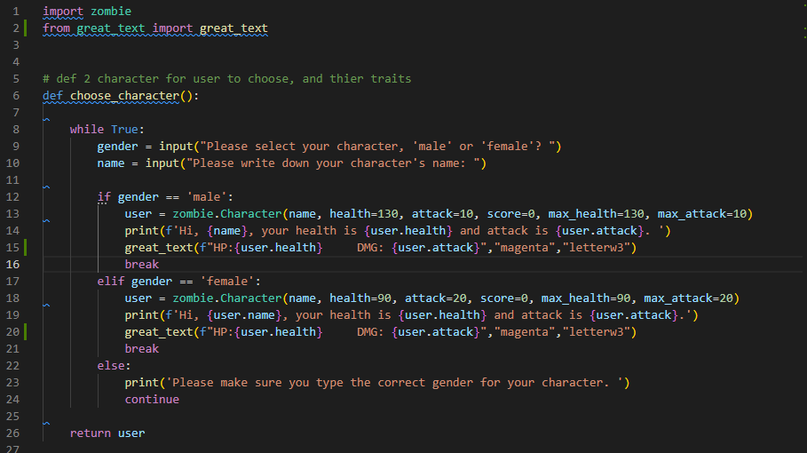

# T1A3 Terminal Application - WING MAN SIU  13183

## Presentation Link >

<>

### R.3. References Source

---
My idea of this application come from a PC game called Left 4 Dead (L4D) which is a FPS Zombie game. So I used those special zombies' name from this game to be my application's bosses.

### R.4. Source Control Repository >

<https://github.com/fishball0741/T1A3>

### R.5. Identify any code style guide or styling

---

.1 In Choose.py, there are one feature called choose_character() which is for asking the user to choose a character and named the character. Since the user typed the correct gender which is male/ female and named the character then the system will output the character's traits such as (name, health, attack etc.) For the traits of the character which is from the class that I made in another file (zombie.py) so I did the import that file.
Moreover, I imported the 3rd party module which can output 3D and colorful text.
In case the user may type the wrong input to break the code, I did the loop to prevent that problem. The loop can make sure the correct input will transfer to the correct output. And the wrong input will ask the user to type again.
At the end, I did the return user to make sure the input can be used again for my whole application.
---

.2 

### R.6. Develop and Describe THREE Features

### R.7. Develop an implementation plan

### R.8. A set of instructions to install the application