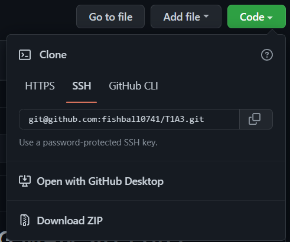
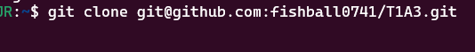
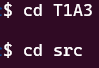
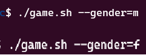

# Package

This is my Termainal Application Repo below. 
[Github-fishball0741-T1A3](https://https://github.com/fishball0741/T1A3/)
...


## How to install and execute:

---


Press the Greed Color 'Code' Button or:
Copy this link below:
```(git@github.com:fishball0741/T1A3.git)```
And then go to your terminal



Type:  ```git clone git@github.com:fishball0741/T1A3.git```
After cloned the file, you can type


```cd T1A3```   #for direct to the folder (T1A3)
And  ```cd src```  #for direct to the folder (src)

At the end, you can execute this command below:


```./game.sh```


Also, there are two optional arguments which is ```./game.sh --gender=m``` and ```./game.sh --gender=f```, it is for the user to skip choosing the gender features.

And.. HAVE FUN :)